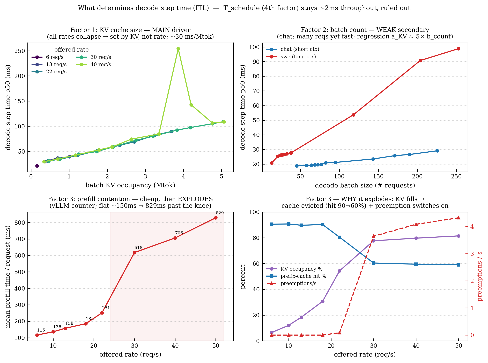
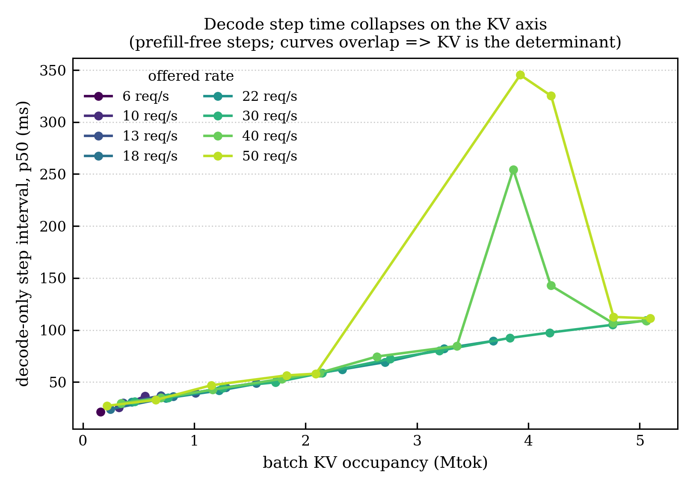
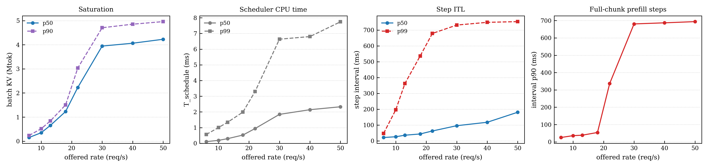
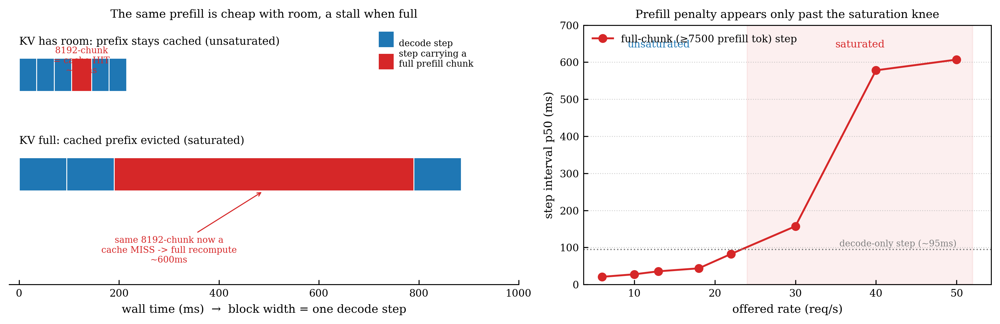
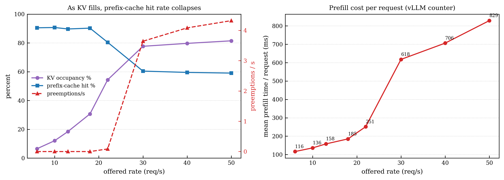

# EXP-16 정리 — decode step 시간은 무엇이 결정하나

**한 줄 결론:** decode 한 step의 시간은 **"그 순간 배치가 들고 있는 KV cache 양"**
하나로 거의 다 설명된다(부하율과 무관). prefill은 **KV가 꽉 찼을 때만** step을
수백 ms로 망가뜨리고, 스케줄러 CPU 시간(T_schedule)은 처음부터 끝까지 무시할 수준(~2ms).

정본/설정: [`EXP-16_per-step-decode-decomposition.md`](EXP-16_per-step-decode-decomposition.md)

## 한 장 요약 — decode step 시간의 3가지 요인

- **요인1 KV cache 크기 (주범):** 순수 decode step 시간이 KV에 비례(~30 ms/Mtok),
  부하율과 무관하게 한 곡선에 붕괴.
- **요인2 배치 요청수 (약한 부차):** 디커플링으로 분리하니 KV의 약 1/5 세기. 작지만 0은 아님.
- **요인3 prefill contention (평소 저렴, 포화 시 폭발):** 요청당 prefill 116→829ms.
  원인은 KV가 차면서 **prefix cache eviction(hit 90→60%) + preemption(0→4/s)**.
- (요인4 T_schedule: 전 구간 ~2ms, 기각.)

---

## 무엇을, 어떻게 쟀나
클라이언트가 재는 토큰 간격은 네트워크/SSE 지터가 섞여 "prefill 때문인지 스케줄러
때문인지"를 못 가른다. 그래서 **엔진 안에 계측기를 심었다**:
`InstrumentedScheduler`(= stock FIFO 순서 그대로 + step마다 로그 한 줄). step마다
`schedule()` 본문 시간(=T_schedule), 다음 step까지 간격(=지터 없는 순수 step ITL),
배치 KV 토큰 수, 얹힌 prefill 토큰 수, decode 요청 수를 기록.

부하율 6/10/13/18/22/30/40/50 req/s를 각각 5분씩(cold-restart) 돌려 ~15만 step 수집.

---

## 결과 1 — decode step 시간은 KV의 함수 (부하율 무관)



prefill이 안 낀 순수 decode step만 뽑아 "배치 KV 양 vs step 시간"을 그리면,
**6부터 50 req/s까지 8개 곡선이 한 선에 포개진다**(20ms→90ms). 즉 step 시간은
*요청이 얼마나 빨리 들어오느냐*가 아니라 *지금 배치가 든 KV가 얼마냐*로 정해진다.
앞서 본 "빠른 모드(37ms)"의 정체도 그냥 **KV가 적은 step**이었다 — 별도의 부하 효과는 없다.

> **주의(정직하게):** 이 워크로드는 요청당 문맥이 ~9.7k로 거의 일정해서 "KV 양"과
> "요청 수"가 비례한다. 그래서 이 그림은 *부하율 무관·KV가 축*이라는 건 증명하지만,
> "**KV 바이트 읽기**가 원인이냐 **요청 개수**가 원인이냐"까지는 못 가른다. 그 분리는
> 아래 Phase 3(decoupling)에서. (다만 과거 cross-workload 실험에서 이미 KV 쪽으로 결론남.)

---

## 결과 2 — T_schedule(스케줄러 CPU)은 원흉이 아니다


(2번째 패널)

`schedule()` 본문에서 쓰는 CPU 시간은 부하율 6→50 내내 **p50 0.1→2.3ms, p99 ~7.7ms**.
대기 큐가 아무리 깊어도 안 커진다. step 시간(수백 ms)의 **1% 미만**. → "높은 부하에서
스케줄러 오버헤드가 쌓여 ITL이 커진다"는 이전 추정은 **틀렸다**. 수백 ms를 만드는 건
CPU가 아니다.

---

## 결과 3 — "Prefill은 포화 조건부" 가 무슨 뜻이냐 (쉬운 설명)



**prefill** = 새 요청의 긴 입력을 한꺼번에 계산해 KV에 채워넣는 무거운 작업.
이게 decode step에 끼면 그 step이 느려지는데 — **느려짐의 크기가 "KV가 얼마나
찼느냐"에 따라 완전히 달라진다.** 진짜 원인은 **prefix cache eviction**이다:

full-chunk step은 rate와 무관하게 **매번 정확히 8192 토큰을 스케줄**(=엔진의
`max_num_batched_tokens` 상한). 즉 명목 작업량은 일정한데:
- **KV에 여유 있을 때(≤18 req/s):** 요청 프롬프트의 앞부분이 KV에 **캐시로 남아
  있어서**, 8192짜리 chunk라도 대부분 **캐시 히트** → 엔진이 캐시된 블록 계산을
  건너뜀 → **~20–44ms**. (searcharena의 ~910토큰 시스템 프롬프트, swe의 공유 repo
  컨텍스트가 캐시됨 — automatic prefix caching on.)
- **KV가 꽉 찼을 때(≥30 req/s):** KV pool이 활성 decode 요청들의 KV로 꽉 차서
  **캐시된 프리픽스가 쫓겨남(evict)** → 같은 프롬프트가 **캐시 미스** → 8192 토큰
  **전체 재계산** → **~580–690ms** (8192×70B TP2 실계산 시간과 산술 일치).

즉 밀려나는 건 decode 요청이 아니라 **prefix 캐시**다. **"prefill이 나쁘다"가 아니라
"KV 압박이 캐시를 밀어내서, 싸던 캐시-히트 prefill을 전체 재계산으로 바꾸는 것".**
(오른쪽 그래프: 포화 knee ~22 req/s를 넘으면 full-chunk step 비용이 절벽처럼 뛴다.)
이게 클라이언트가 보던 ITL 600–700ms 꼬리의 정체다.

> 근거: sched_tok=8192 고정 + interval 29배 차이 + corr(prefill토큰,interval)≈0
> + FLOP 산술(8192 실계산≈600ms) + decode 붕괴가 안 깨짐(smear 아님, sum(iv)≈span).
> **단 step당 cache hit 여부를 직접 로깅하진 않았으니 "강한 추론"** — 확정하려면
> cache-hit 필드 하나 더 찍으면 됨.

---

## 결과 4 — 포화의 두 메커니즘 (vLLM 자체 카운터로 확증)



KV가 54%→78%로 차는 순간(부하 22→30 req/s) **두 가지가 동시에 켜진다** — 둘 다
vLLM 자체 카운터(내 계측과 독립, async 문제 없음):

1. **prefix cache eviction**: hit율 **90%→60%**로 붕괴. (결과 3의 원인)
2. **preemption**: **0/s → 3.6~4.3/s**로 점화.

**preemption이 정확히 뭐냐 (vLLM 스케줄러 소스 기준):** 매 스텝 스케줄러는 decode 중인
각 요청에 다음 토큰용 KV 블록 1개를 할당하려 함. **KV pool이 완전히 꽉 차서 할당 실패**하면
(`allocate_slots` → None) 희생양 요청을 골라(FIFO=running 리스트 마지막) `_preempt_request`:
그 요청의 **KV를 전부 반납**(`kv_cache_manager.free`)하고 **진행도를 0으로 리셋**
(`num_computed_tokens=0`)해 **대기 큐 맨 앞으로** 되돌림. 나중에 재개될 때 **프롬프트+
그동안 생성한 토큰을 처음부터 다시 prefill(recompute)** 해야 함 = 여태 한 일이 낭비.
즉 밀리는 건 **decode 요청**이고, "prefill 때문"이 아니라 **KV 고갈** 때문(prefill·decode
둘 다 KV를 먹어 pool을 100%로 밀어붙임). `vllm:num_preemptions_total`로 실측 확인.

이 두 개가 서로를 먹인다: **KV 참 → cache evict + decode preempt → 재계산 일감 증가
→ KV 더 압박.** 이게 붕괴의 엔진 내부 실체다. (요청당 prefill 시간 116→829ms의 원인.)

---

## 종합 모델
```
step_time ≈ C0 + a·(배치 KV 양) + c·(prefill 덩어리)·[KV 포화 시만] + (preemption, pool 초과 시)
            └ T_schedule(~2ms 상수)은 무시 가능
```
- **a·KV**: 주항. 20→90ms, 부하 무관. ✓ (직접 관측; 회귀 a≈30 ms/Mtok)
- **b·count**: 작은 부차항. 디커플링으로 분리 → **b≈0.055 ms/req = KV의 약 1/5**. 0은 아님. ✓
- **c·prefill**: KV/batch와 직교(독립). 포화 전엔 ~0, 포화 후 full chunk가 +수백 ms. ✓
- **T_schedule**: 상수 ~2ms. 드롭. ✓

**분리 상태 요약:** T_schedule ✓ / prefill ✓ / **KV-vs-요청수 ✓ (Phase 3에서 분리 완료)**

---

## KV vs 요청수 분리 (Phase 3, 완료)
문제: mix 워크로드는 문맥 길이가 일정해 "KV"와 "요청수"가 붙어다녀(VIF 46) 회귀가 못 가름.
해법(옵션 A 실행): **짧은-문맥(chat)과 긴-문맥(swe) 워크로드를 각각 단독으로** 돌려
per-step 데이터를 합침. 두 워크로드의 문맥 차이가 (KV, 요청수) 평면을 대각선 밖으로 채움.
- 결과: pooled 회귀 **VIF 46→1.3** → 분리 성공. **a(KV)=29.9 ms/Mtok, b(요청수)=0.055 ms/req.**
- 해석: 전형적 포화 배치(KV~5Mtok, 요청 600)에서 KV항 ~150ms vs 요청수항 ~33ms →
  **KV가 주항(약 4.5×), 요청수는 작지만 0 아님.** ("b≈0"이라던 이전 진술을 교정.)
- caveat: pooled R²=0.36(선형모델이 prefill/preempt 비선형 미포함) — 계수는 방향성으로 신뢰.
- 그림: `figs/exp16_decouple/exp16_decouple_{plane,terms}.png`.

상세: [`EXP-16_...md`](EXP-16_per-step-decode-decomposition.md) §Phase 3.

---

## 그림 인덱스 (`figs/exp16_sweep/`, `figs/exp16_decouple/`, `figs/exp16/`)
| 파일 | 내용 |
|---|---|
| `exp16_sweep/exp16_three_factors.png` | **한 장 요약: 3가지 요인 (강추)** |
| `exp16_sweep/exp16_saturation_mechanism.png` | cache evict + preemption vs rate (결과 4, vLLM 카운터) |
| `exp16_sweep/exp16_kv_collapse.png` | 8개 rate가 KV축에 한 곡선으로 붕괴 (결과 1) |
| `exp16_sweep/exp16_vs_rate.png` | rate별 포화/ T_schedule/ step ITL/ prefill 꼬리 |
| `exp16_sweep/exp16_prefill_conditional.png` | prefill 포화 조건부 개념+실측 (결과 3) |
| `exp16_decouple/exp16_decouple_{plane,terms}.png` | KV vs 요청수 분리 (Phase 3) |
| `exp16/exp16_{bimodal_interval,terms,tschedule}.png` | Phase1 진단 그림들 |
